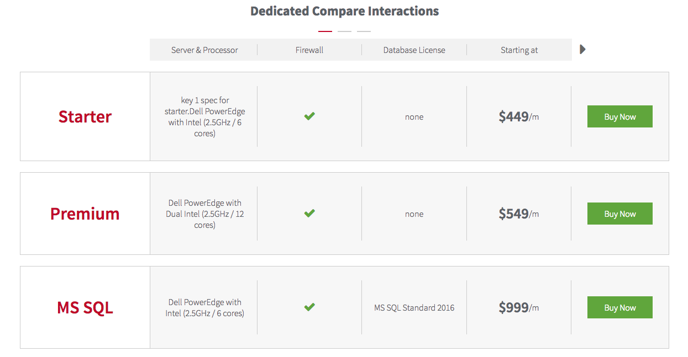

## Rackspace Bundle Compare Pattern
Currently a WIP.



[See Live Demo](http://b908c4040f36e92b6c1d-5868806ce06e7becdec4f0e74f1f735c.r92.cf1.rackcdn.com/static/bundle-compare/index.html)

### Install
```
npm install
```
```
npm start
```
### Gulp Tasks
Gulp tasks will run automatically but to manually run them:

Build dist/
```
gulp build-dist
```

Building Javascript: This will concat the js files together in order by name:
```
gulp build-js
```

Building SASS
```
gulp build-sass
```
